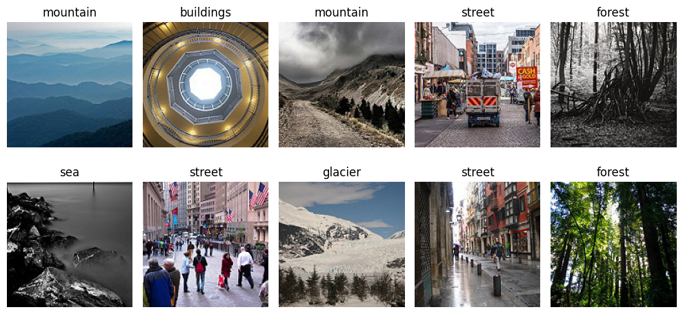
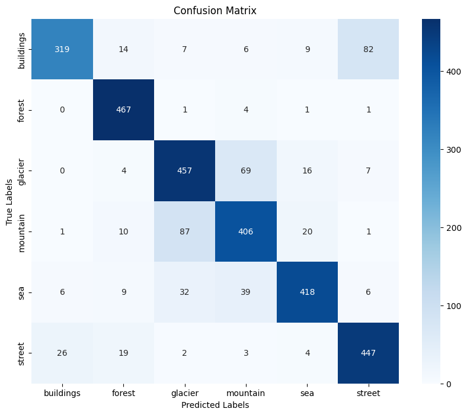
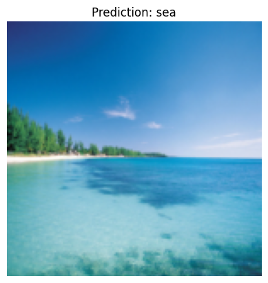

# Intel Image Classification with DenseNet Implementation in pytorch
This is a pytorch implementation of DenseNet for the Intel Image Classification. Image classification refers to the task of assigning a label or class to an input image based on its content. This is one of the core problems in Computer Vision that, despite its simplicity, has a large variety of practical applications.

Further, this notebook tries to implement DenseNet architecture for the Intel Image Classification dataset. The DenseNet architecture is a variant of the ResNet architecture. The main difference between DenseNet and ResNet is that in DenseNet, each layer is connected to all other layers that are deeper in the network. In ResNet, each layer is connected only to the layers that are just before and after it. DenseNet has several compelling advantages: they alleviate the vanishing-gradient problem, strengthen feature propagation, encourage feature reuse, and substantially reduce the number of parameters.\
**For more details about architecture refer to the [paper](https://arxiv.org/pdf/1608.06993.pdf).**

## Dataset
The Data contains around 25k images of size 150x150 distributed under 6 categories.
``` python
{
    'buildings' -> 0,
    'forest' -> 1,
    'glacier' -> 2,
    'mountain' -> 3,
    'sea' -> 4,
    'street' -> 5
}
```
The Train, Test and Prediction data is separated in each folders. There are around 14k images in Train, 3k in Test and 7k in Prediction. The dataset can be downloaded from [here](https://www.kaggle.com/puneet6060/intel-image-classification).\
Following are some sample images from the dataset.


## Usage
This notebook was made using Google Colab and is expected to be run on it. The dataset is uploaded to Google Drive and downloaded to the Colab notebook.
The notebook is self-explanatory and can be run cell by cell. Click on open in Colab button to open the notebook in Colab.\
<a target="_blank" href="https://colab.research.google.com/github/SrjPdl/intel_image_classification_densenet">
  
</a>

## Results
The model was trained for 10 epochs with a batch size of 32. The loss function used was Cross Entropy Loss and the optimizer used was Adam with a learning rate of 0.001.\
The test data metrics are as follows:
``` python
Test Loss: 0.4875
Accuracy: 0.8380
```
Following figure shows the confusion matrix for the test data.\
\
From the confusion matrix, we can see that the model struggles a bit is to classify the images of glacier and mountain. This is because the images of glacier and mountain are quite similar. Also, same with that of buildings and street as they are occur in the same environment.

Following figure shows the sample predictions made by the model on unseen data.\


## References
1. [Densely Connected Convolutional Networks](https://arxiv.org/pdf/1608.06993.pdf)
2. [Intel Image Classification](https://www.kaggle.com/puneet6060/intel-image-classification)
3. [DenseNet Implementation in Pytorch](https://github.com/bamos/densenet.pytorch/tree/master)
4. [Understanding and visualizing DenseNets](https://towardsdatascience.com/understanding-and-visualizing-densenets-7f688092391a)
5. [DenseNet Architecture Explained with PyTorch Implementation from TorchVision](https://amaarora.github.io/posts/2020-08-02-densenets.html)

## Author
Suraj Poudel


